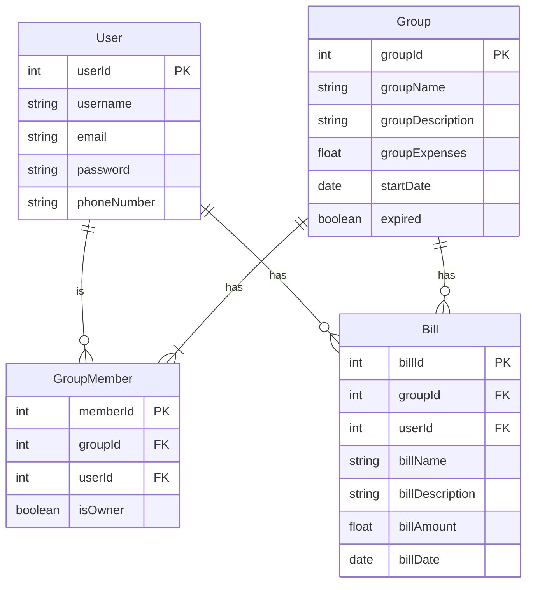

```mermaid
erDiagram
    User {
        int userId PK
        string username
        string email
        string password
        string phoneNumber
    }
    Group {
        int groupId PK
        string groupName 
        string groupDescription
        float groupExpenses
        date startDate
        boolean expired
    }
    Bill {
        int billId PK
        int groupId FK
        int userId FK
        string billName
        string billDescription
        float billAmount
        date billDate
    }
    GroupMember {
        int memberId PK
        int groupId FK
        int userId FK
        boolean isOwner
    }
    
    %% A user can be a part of zero or multiple groups
    User ||--o{ GroupMember : "is"

    %% A user has zero or more bills
    User ||--o{ Bill : "has"

    %% A group has to have one or more group members 
    Group ||--|{ GroupMember : "has" 

    %% A group has zero or more bills
    Group ||--o{ Bill : "has"
```